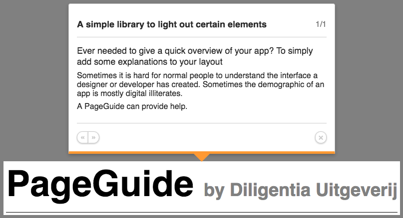

# PageGuide



## installation
```
npm install --save pageguide
```

## usage
```
<head>
  <title>PageGuide &mdash; a demo</title>
  <meta name="pageguide" content="pageguide.demo">
  <script src="/assets/pageguide.min.js"></script>
  <script>
    pageGuide = new PageGuide({
      "pageguide.demo": [
        {
          "id": "html-element-id",
          "title": "PageGuide title",
          "position": "top", // top, top-left, top-right, right, right-top, right-bottom, bottom, bottom-left, bottom-right, left, left-top, left-bottom
          "content": "<p>You should provide valid HTML markup, <em>but whatever</em>.</p>"
        }
      ]
    });
  </script>
</head>
```

There are 2 possibilities to specify a guide:

1. **page title**: You can specify a dataset by using the page title. In this example that would translate as:
    ```
    new PageGuide({ "PageGuide &mdash; a demo": [...] })
    ```
2. **meta tag**: Simply provide the page with a meta-tag: `<meta name="pageguide" content="whatever-string-you-seem-fit" >`
    This will translate into:
    ```
    new PageGuide({ "whatever-string-you-seem-fit": [...] })
    ```

### alternative usages
#### JSON
You can put the guides in a single JSON as not to clutter a script-tag.
```
<head>
  <title>page title</title>
  <script src="/assets/pageguide.min.js"></script>
  <script>
    pageGuide = new PageGuide('path/to/pageguide-data.json');
  </script>
</head>
```

#### YAML
YAML is not loaded by default, but you could use a YAML parser and provide the parsed data to the PageGuides.

```
$.ajax({ url: '/assets/guide.yml'})
    .done(function(data) {
      var guide = jsyaml.load(data);
      pageGuide = new PageGuide(guide);
    });
```

## Options
Basically you must provide the PageGuide with an object containing arrays specified by an identifier string, which can 
be the contents of a meta-tag, or the page-title.    
A single guideObject contains:

- **id**: The ID of the DOMElement you want to provide extra information about.
- **position**: How the PageGuide will be positioned, you can pick any of these options:
  - top
  - top-right
  - top-left
  - right
  - right-top
  - right-bottom
  - bottom
  - bottom-right
  - bottom-left
  - left
  - left-top
  - left-bottom
- **title**: The title that will be displayed inside a `h1`.
- **content**: The contents to be displayed inside a `div`. This gives you all freedom of HTML-contents, but also means 
that you should put the contents in `p` tags.

## Questions

> **What about dynamically added and removed DOMElements?**    
> When a guide is started, it will assess all provided ID's and only iterate the currently existing elements. This 
> includes dynamically added elements.